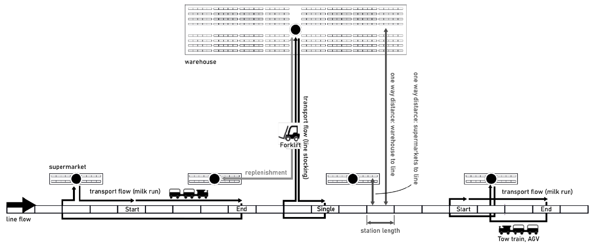

# Assembly Line Feeding Problem with Multiple Supermarkets (MILP)

Extension of the Assembly Line Feeding Problem model by Adenipekun et al. (2022), integrating multiple supermarkets into the existing MILP framework. The model optimizes feeding policies, vehicle types, routes, and supermarket allocation to minimize total logistics costs. Implemented in Python using Gurobi and evaluated via numerical experiments.

This repository contains the full implementation of the MILP model developed in our seminar paper:

[Final Report (PDF)](final-report-assembly-line-feeding-problem.pdf)

The model extends the Assembly Line Feeding Problem (ALFP) by introducing multiple supermarkets and integrating tactical supermarket assignment decisions into the existing cost-minimization framework.

The implementation is written in Python using Gurobi.

## Model Overview

The model simultaneously determines:

- Feeding policies per part
- Vehicle type selection
- Route assignment
- Fleet sizing
- Assignment of parts to supermarkets
- Activation and capacity of multiple supermarkets

**Objective:** minimize total feeding costs including:

- Transportation costs  
- Replenishment costs  
- Preparation costs  
- Usage costs  
- Supermarket operating costs

For full theoretical background, formulation, numerical experiments, and results, please refer to the included paper.


## Data
Datasets are algorithmically generated and correspond to the experimental design described in the paper.

### Fixed constants (`data/Input_data/`)

These inputs are derived from Adenipekun et al. (2022) or chosen by us for the numerical experiments:

- `Input_Data.xlsx`
- `n_pm.xlsx`
- `l_pm.xlsx`
- `n_f.xlsx`

### Distance matrices

Distance matrices encode distances from storage locations to assembly stations.

Storage locations include:

- One central warehouse
- One or more supermarkets 

There is only ever one warehouse but the number of supermarkets and stations can differ. 

<p align="center">
  
</p>

<p align="center"><em>
Assembly line layout showing warehouse, supermarkets, and stations used to interpret the distance matrices.
</em></p>

Two matrix types are used:

#### 1. Storage → Stations

Distances from:

- Warehouse (first row)
- Supermarket(s) (subsequent rows)

to each assembly station.

Example: data/datasets/distance_matrix_10x2_storage_to_stations.xlsx

#### 2. Warehouse → Supermarkets

Distances between warehouse and supermarkets: data/datasets/distance_matrix_10x2_warehouse_to_supermarkets.xlsx


### Instance naming convention

Example: `10x2`

- `10` → number of assembly stations  
- `2` → number of supermarkets  

Distance matrices and assignments with the same station count are compatible.


### Part-to-station assignments

The part-station assignments tell which part number is required at which station during the assembly. 

Examples:

- data/datasets/ 
  - part_station_assignment_10_00.xlsx
  - part_station_assignment_10_01.xlsx
  - part_station_assignment_10_02.xlsx
  - ...

Naming convention: i.e. `10_00`, `10_01`, `10_02`

- `10` → number of stations  
- `02` → indicates a part-station assignment variation (i.e. these variations can represent different car models on the same automotive assembly line).

All assignments with the same station count are compatible with any distance matrix of that station size.

## Requirements
- Python 3.10+
- Gurobi (licensed)

Install dependencies:

```bash
pip install -r requirements.txt
```

## Run 

### Quickstart
Run one instance (default)
```bash
python -m src.run_experiment
```
This runs:
- instance=`10x2`
- assignment=`10_02`
- time limit = 600 seconds
- free feeding-policy choice (recommended default)

### Run one instance with explicit parameters
Please take a look at data/datasets to see which values for the CLI parameters `instance` and `assignment` can be used with the available datasets.

```bash
python -m src.run_experiment --instance 10x2 --assignment 10_02 --time-limit 600
```

### Batch mode (append all runs to results/runs.csv)
Run a custom list:
```bash
# 10 Stations with 2 supermarkets (3 variations of part-station assignments)
python -m src.run_experiment --instance 10x2 --batch --assignments "10_00,10_01,10_02"

or

# 20 Stations with 4 supermarkets (3 variations of part-station assignments):
python -m src.run_experiment --instance 20x4 --batch --assignments "20_00,20_01,20_02"
```

## Outputs
After each run, the script writes:
- **results/run_summary_<instance>_<assignment>_<timestamp>.txt**: Contains timestamp + metadata + status + objective + runtime.
- **results/runs.csv**: One row per run (great for experiment tracking / plotting).

If a solution exists, the model may also write a .sol file.
If infeasible, it may write an IIS .ilp file.

## Authors

Felix Reibold (M.Sc.); Steffen Voigtländer (M.Sc.)
